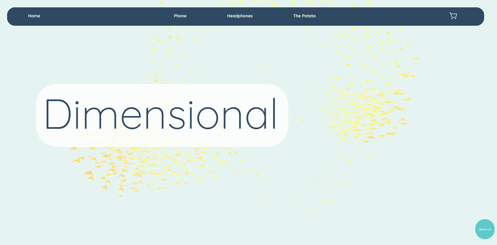
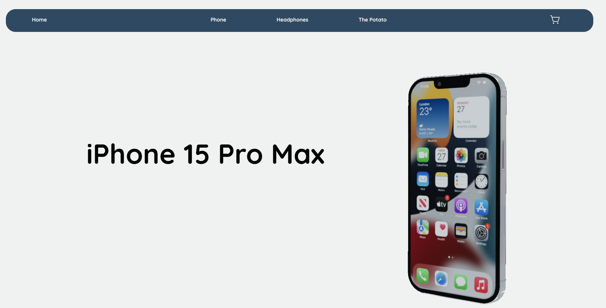
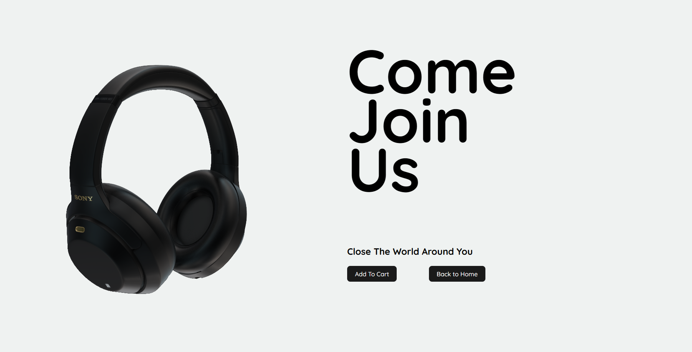
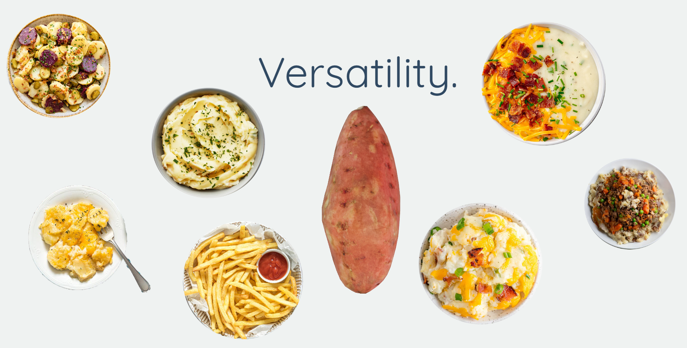
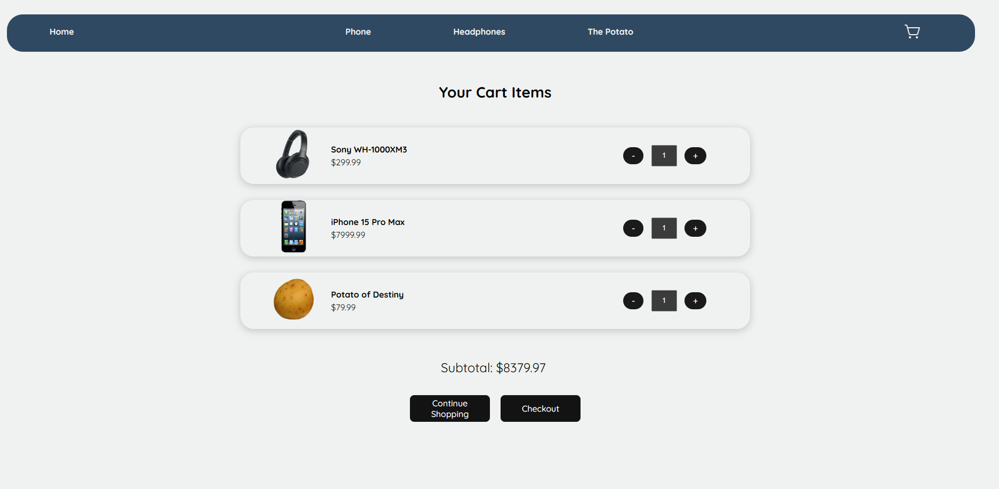
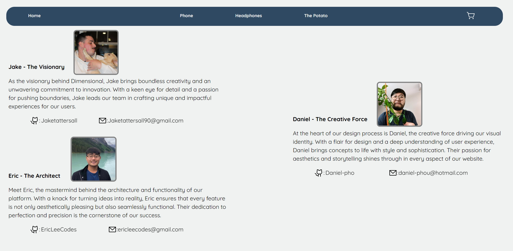

# Welcome to Dimensional 🌟
Check out our website here!: https://www.dimensionalproject.org/
 
Welcome to the forefront of e-commerce innovation! At Dimensional, we're revolutionizing online shopping by bringing the physical store experience directly to your screen. Say goodbye to static images and hello to a dynamic, immersive journey through our 3D showcase of products.

## What Sets Us Apart 🚀

### Immersive Shopping Experience 🛍️:

Imagine being able to interact with products just like you would in a physical store. With Dimensional, that's exactly what you get. Our 3D technology allows customers to explore every angle, detail, and feature of a product, putting you in control of your shopping experience.

### Bridge Between Online and Offline 🌐🏢:

We're bridging the gap between traditional brick-and-mortar stores and online shopping. With Dimensional, you get the tactile experience of in-person shopping right from the comfort of your own home. No more guesswork or disappointment when your package arrives – what you see is exactly what you get.

### Personalized Engagement 🤝:

At Dimensional, every purchase is a personal journey. Our platform allows you to engage with products in a way that traditional e-commerce simply can't match. From exploring intricate details to visualizing how an item fits into your life, we empower you to make informed decisions with confidence.

</img>

 

</img>

 

</img>

 

</img>

 

</img>

## Meet the Creators 🙌

### Eric - The Architect 🧠:

Meet Eric, the mastermind behind the architecture and functionality of our platform. With a knack for turning ideas into reality, Eric ensures that every feature is not only aesthetically pleasing but also seamlessly functional. Their dedication to perfection and precision is the cornerstone of our success.

### Daniel - The Creative Force 🌈:

At the heart of our design process is Daniel, the creative force driving our visual identity. With a flair for design and a deep understanding of user experience, Daniel brings concepts to life with style and sophistication. Their passion for aesthetics and storytelling shines through in every aspect of our website.

### Jake - The Visionary 🎨:

As the visionary behind Dimensional, Jake brings boundless creativity and an unwavering commitment to innovation. With a keen eye for detail and a passion for pushing boundaries, Jake leads our team in crafting unique and impactful experiences for our users.

</img>

## Get Started Today! 💼

Ready to embark on your immersive shopping journey? Join us at Dimensional and experience the future of e-commerce firsthand. Whether you're a trendsetter looking for the latest fashion or a tech enthusiast exploring cutting-edge gadgets, Dimensional has something for everyone.

## Tech Stack 💻

Dimensional is built on a robust tech stack, leveraging state-of-the-art tools and frameworks to deliver a seamless user experience.

WebGI: Utilizing advanced WebGI technology for stunning 3D visualizations.
Vite: Fast, modern build tooling for blazing-fast development.
React + Vite: Harnessing the power of React with Vite for lightning-fast performance.
GSAP: Incorporating GSAP for smooth animations and transitions.
Vanta: Introducing Vanta for mesmerizing background effects.
React Router: Navigating seamlessly with React Router for a smooth user experience.
Phosphor React: Enhancing UI elements with the beautiful Phosphor React icon library.
React Toastify: Providing elegant toast notifications with React Toastify.

## Thank You for Your Support! 🙏

As the culmination of our journey at Lighthouse Labs, Dimensional represents our collective vision and dedication to pushing the boundaries of what's possible in e-commerce. We're grateful for the opportunity to share our passion with you and look forward to shaping the future of online shopping together.
